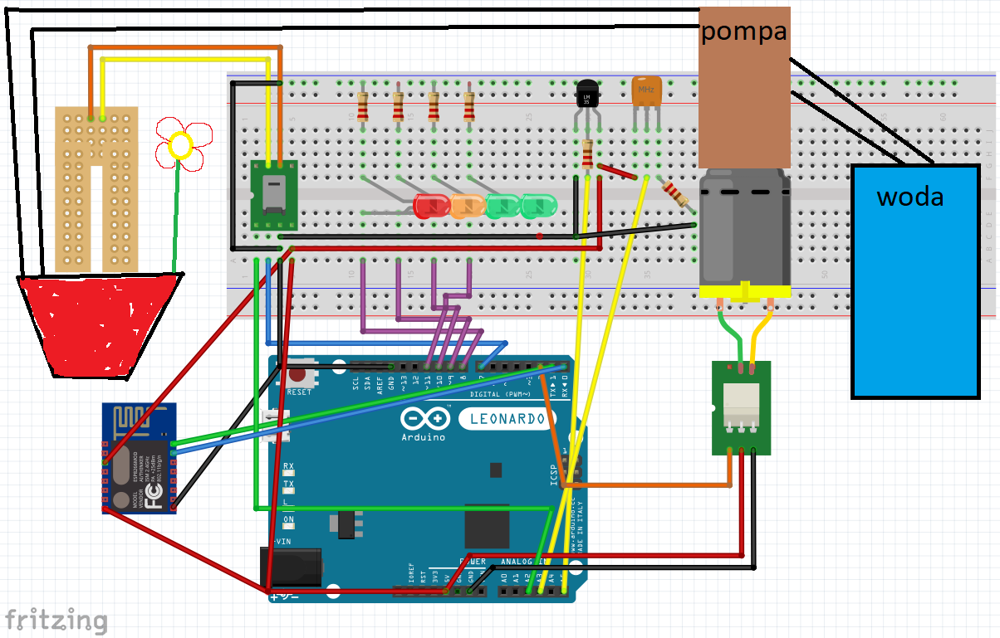

# projekt_nawadnianie
System nadzoru parametrów rozwoju rośliny oparty o mikrokontroler Arduino Uno wraz z zastosowaniem pompy perystaltycznej 

Uklad stale dokonuje pomiarów wilgotności gleby , poziomu usłonecznienia oraz temperatury. Pomierzone wartości z czujników przekazywane są na wejścia analogowe Arduino.
Pomiary dokonywane są z zadaną częstotliwością - w zależności od ustawienia wartości zmiennej układ dokonuje zliczeń n pomiarów. Spadek wilgotności gleby poniżej wartości krytycznej powoduje załączenie przekaźnika pompy, co uruchamia silnik i woda zaczyna być pompowana ze zbiornika źródłowego do doniczki. Ponadto umożliwione jest monitorowanie na charakterystykach wartości parametrów w czasie poprzez stronę internetową.

